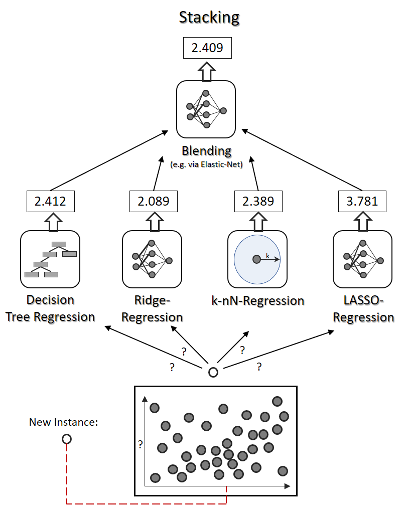

# Stacked Generalisation for MNIST
---
A ***Ensemble Learning*** is inspired by the concept of the *Wisdom of the Crowd* - the idea that the combined knowledge of many individuals is better than that of one. In the context of Machine Learning, an ensemble can be build by using a number of unique predictors, whose predictions are combined to produce the final result. **These tend to perform better than standard predictors.** 

Some of the most popularly used *ensemble methods* (ensemble learning algorithms) include:
* [Voting Classifiers]()
* [Bagging and Pasting]()
* [Random Forests]()
* [Boosting - AdaBoost and Gradient Boosting]()
* [**Stacking**]()

## Motivations
**This project is for purely intellectual purposes**, and any conclusions and findings made here may not be directly application for analysis of data other than MNIST. These findings should have give readers a better initution as to how a stacking ensemble works and out performs non-stacking based algorithms. 

A stacked ensemble consists of many tuned models also, so a deeper understanding of a variety of different machine learning models will be required, and gained, over the duration of this project. In proffessional projects, ensemble methods tend to be used towards the end of the model build and tuning phase, after a number of model have been short listed to be used.

Hence, the main goals of this analysis/project will be:
1. to tune and make predictions using several non-ensemble predictors;
2. to construct and tune a stacked ensemble;
3. to compare the performace of a hand-build stacked ensemble to ensembles provided by scikit-learn;
4. to compare the performance of a hand-build stacked ensemble to existing open source implementations such as [brew]()******;
5. to enter the beginners Handwritten Digits Classification rolling challenge on Kaggle.

## Technical Details
### Stacking

### Predictors 
I intend to use the following predictors:
* SGD Classifier - scikit-learn
* Random Forest Classifier - scikit-learn
* SVM Classifier - scikit-learn
* Recurrent Neural Network - Keras
* Convolutional Neural Network - Tensorflow
* K-Nearest Neighbours - scikit-learn

### Existing Implementations

## References 
[] Hands-on Machine Learning with Tensorflow and Scikit-Learn
[] http://blog.kaggle.com/2016/12/27/a-kagglers-guide-to-model-stacking-in-practice/
[] https://mlwave.com/kaggle-ensembling-guide/

---
****** *This experiment is not entirely fair, in that brew models may contain be contructed with other classifiers. This is more a case of seeing how much more tuning is needed is my own model and just generally weighing up the pros and cons of each.* 
